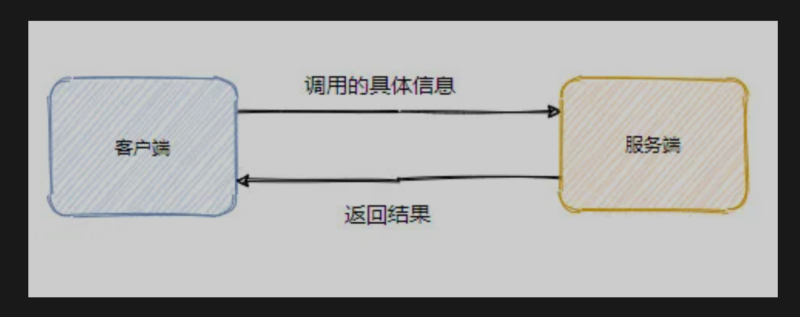
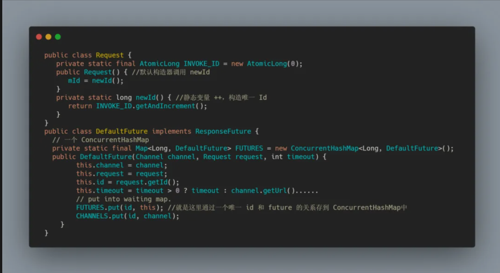

> reference
>
> [https://mp.weixin.qq.com/s?__biz=MzAwNDA2OTM1Ng==&mid=2453146350&idx=1&sn=059e12e95c2866e54d714012bc4f7d10&scene=21#wechat_redirect]()

## 前记

在面试漫谈--dubbo篇中，有说这部分的内容，但感觉就很虚，这此来认真的分析一下具体的调用过程。

在这几天的整理文章中，我更多的使用更加详细的话语来描述，之前在我看来都是废话，主需要抓住核心就可以了。但是那样的话是不利于复习的，再加上我本身就词库贫乏所以会显得任何东西一句话就说完了。对别人的印象还是有差别的。所以我会尽可能的多写，让事务看起来更加立体，丰富！

## 简单的想想大致流程

首先我们需要知晓远程服务的地址，然后要做的就是把我们要调用的方法具体信息告知远程服务，让远程服务解析这些信息，然后根据这些信息找到对应的实现类，然后进行调用，调用完了之后再原路返回，最后客户端解析响应返回即可





## 调用的具体信息

根据上图的框架，我们先来看看调用的具体信息有哪些

首先客户端肯定要告知调用的是服务端的哪个接口，当然还需要方法名，参数类型，参数值，还有可能存在多个版本的情况，所以还得带上版本号

通过上面的几个参数，服务端就可以知道哪个方法，可以进行精确调用

然后组装响应返回即可


## 落地的调用流程

上面是想象的调用流程，在真实的调用流程中：

首先远程调用需要定义协议，也就是互相约定我们要讲什么样的语言

## 需要一个协议

应用层一般有三种类型的协议形式，分别是：固定长度形式，特殊字符隔断形式，header+body形式

dubbo的协议属于 header+body 形式，而且也有特殊的字符0xdabb，这是用来解决TCP网络粘包问题的

## Dubbo协议


协议分为协议头和协议体，16个字节的头部主要携带了魔法树，也就是之前说的0xdabb，然后一些请求的设置，消息体的长度。16字节后，就是协议体，包括协议版本，接口名字，版本，方法名等


## 需要约定序列化器

网络是以字节流的形式传输的

## 序列化协议

上图发现，dubbo支持很多种序列化

序列化大致分为俩种：一种是字符型，一种是二进制流

- 字符型的代表就是JSON，缺点是传输的效率低
- 二进制流：对机器更友好，传输更快

dubbo默认使用hessian2序列化协议

## 粗略的调用流程图


客户端发起调用，实际调用的是代理类，代理类最终调用的是client（默认netty），需要构造好协议头，然后将java的对象序列化生成具体协议体，然后网络调用传输。服务端的NettyServer接受到请求后，分发给业务线程池，由业务线程调用具体的数显方法

但这还不够，DUBBO是一个生产级别的RPC框架，需要更加安全，稳重

## 详细的调用流程


 

服务端往往会有多个，多个服务端的服务就会有多个Invoker 最终需要通过路由过滤，然后再通过负载均衡机制选出一个Invoker进行调用

当然还有Cluster的容错机制，包括重试等等

# 调用流程-客户端源码分析

```java
String hello = demoService.sayHello("world")
```

会生成代理类，代理类会生成一个RpcInvocation对象调用MockClusterInvoker#invoke方法

RpcInvocation如下图所示，包含方法名，参数类和参数值


调用 MockClusterInvoker#invoke 代码，判断有没有mock

调用 AbstractClusterInvoker#invoke 代码，过滤，负载


## 模板方法

模板方法其实是在抽象类中定好代码的执行骨架，然后将具体的实现延迟到子类中，由子类来定义个性化的实现。也就是说可以再不改变整体执行步骤的情况下修改步骤里面的实现，减少了重复代码，也利于扩展，符合开闭原则

在代码中就是上图的doInvode由子类来实现，上面的一些步骤都是每个子类都要走的，所以抽到抽象类中

## 路由和负载均衡得到Invoker

再来看List(invocation)，其实就是通过方法名找到Invoker，然后服务的路由过滤


然后带着这些Invoker再进行一波Loadbalance，得到一个Invoker，默认使用 FailoverClusterInvoker 也就是失败自动切换的容错方式。

总结一下就是 FailoverClusterInvoker 拿到 Directory 返回的 Invoker 列表，并且经由路由之后，他会让 LoadBalance 从 Invoker 列表中选择一个 Invoker。最后 FailoverClusterInvoker 会将参数传给选择出的那个 Invoker 实例的 Invoke 方法，进行真正的远程调用。下面是 FailoverClusterInvoker#doInvoke


## 调用的是三种方式

1. oneway
2. 异步调用，dubbo是天然异步的，可以看到client发送请求后会得到一个ResponseFuture，然后把future包装一下塞到上下文中
3. 同步调用，比较常用，其实是dubbo框架帮主我们异步转同步了，从代码可以看到dubbo源码只用调用 future.get，所以给永远忽的感觉就是我调用了这个接口然后就阻塞了，必须要等替代结果返回才能返回

回到源码中， `currentClient.request` 源码就是如下组装request然后构造一个future然后调用NettyClient发送请求


再看一下 DefualtFuture 的内部。因为是异步，那么future保存了之后，等相应回来如何找到对应的future呢------通过唯一ID



可以看到request会生成一个全局的唯一ID，然后又future内部会将自己和ID存储到一个ConcurrentHashMap、这个ID发送到服务端后，服务端也会把这个ID返回来，这样通过ID再去ConcurrentHashMap中就可以找到对应的Future


发起请求的调用链


处理请求响应的调用链


# 调用流程-服务端源码分析

服务端收到请求后会解析请求消息，默认的将消息都发到业务线程中


将消息封装成一个ChannelEventRunnble扔到业务线程中执行，ChannelEventRunnable里面会根据ChannelState调用相对的处理方法，这里是ChannelState.RECEIVE，所以调用handler.received，最终会调用HeaderExchangeHandler#handleRequest


重点：构造的响应先塞入请求的Id，再看看reply干了啥


会调用一个Javassist生成的代理类，里面包含了真正的实现类。再来看看getInvoker这个方法，看看怎么根据请求的信息找到对应的Invoker


关键就是那个serviceKey，在之前服务暴露将invoker封装成exporter之后再构建了一个servicekey将其和Exporter存入了exporterMap中，这个Map在这个时候起作用了

这个Key长这样


最后补充一张流程图


## 总结

首先客户端调用接口的某个方法，实际调用的是代理类，代理类会通过cluster（这里默认的是FailoverCluster）从directory中获取一堆invokers，然后进行router的过滤（其中看配置也会添加mockInvoker用于服务降级），然后再通过SPI得到loadBalance进行一波负载均衡。现在得到了要调用的远程服务对应的Invoker了，此时根据具体的协议构造请求头，然后将参数根据具体的系列化协议序列化之后构造塞入请求体中，再通过Netty-Client发起远程调用

服务端NettyServer收到请求后，根据协议得到信息并且反序列化成对象，再按照派发策略派发消息，默认是all，扔给业务线程池。业务线程池会根据消息类型判断然后得到serviceKey从之前服务暴露生成的exporterMap中得到对应的Invoker，然后调用真实的实现类。最终将结果返回

因为请求和响应都有一个统一的ID，客户端根据响应的ID找到存储起来的Future，然后塞入响应再唤醒等待Future的线程，完成一次远程调用的全过程


